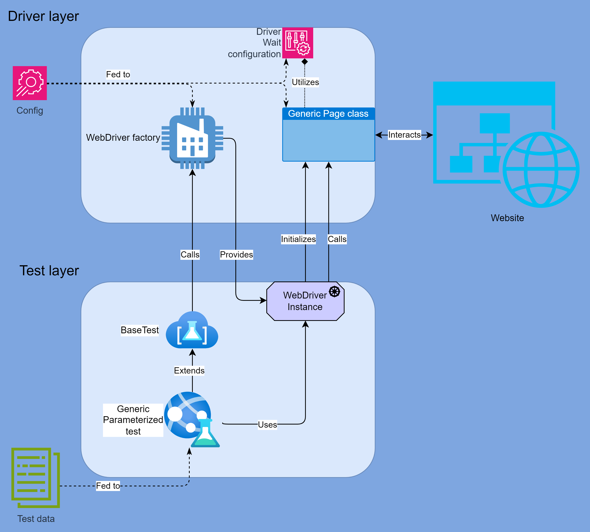

- [Environment configuration](#env-config-example)
- [Driver configuration](#driver-config-example)
- [Feed data to parameterized tests through YAML](#customer-test-data-example)
- [How to run tests](#how-to-run-tests)
- [How does it work](#how-does-it-work)
- [Project structure](#project-structure)
- [High level diagram overview of project code](#high-level-overview)
- [Class diagram](#class-diagram)
- [Driver layer overview](#driver-layer)
- [Test layer overview](#test-layer)
- [TL;DR](#tldr)
- [What's next](#whats-next)


| Configuration           | Default file location                                      | Custom file path program arg |
|-------------------------|------------------------------------------------------------|------------------------------|
| Env configuration       | `src/main/resources/environment.yml`                       | `envConfigFilePath`          |
| Driver configuration    | `src/main/resources/driver.yml`                            | `driverConfigFilePath`       |
| Customer test data feed | `src/test/resources/data/customer-tests-data-provider.yml` | `customerTestDataFilePath`   |

### Env config example:
```yaml
# URL of application under test
appUrl: https://2girls1cup.com/
# URL of Selenium Grid Hub to connect to (for Remote Drivers)
hubUrl: http://my.grid.url/wd/hub
# true if Selenoid Grid is to be used
selenoidEnabled: true
# Selenoid Grid option (enables VNC connections to remote driver sessions)
selenoidVncEnabled: true
# Selenoid Grid option (captures video recordings of remote driver sessions)
selenoidVideoEnabled: false
```

### Driver config example:

```yaml
# WebDriver fluent wait timeout in ms
waitTimeoutMillis: 10000
# WebDriver default implicit wait time in ms
implicitWaitMillis: 500
# WebDriver fluent wait polling interval in ms
pollingIntervalMillis: 50
# WebDriver page load timeout in ms
pageLoadTimeoutMillis: 10000
chromeLocalLoggingEnabled: true
chromeLocalLogPath: src/test/resources/logs
firefoxLocalLoggingEnabled: true
firefoxLocalLogPath: src/test/resources/logs
```
### Customer test data example:
```yaml
# Set of test data goes here
data:
    # Driver type used for the test
  - driverType: CHROME_REMOTE
    # Set of Customer domain objects provided for the test 
    customers:
      - name: Bob
        email: uncle-bob-molester-420@gmail.com
        age: 69
        gender: MALE
      - name: Paul
        email: paul@paul.paul
        age: 30
        gender: MALE
  - driverType: CHROME_REMOTE_HEADLESS
    customers:
      - name: Alice
        email: heriohgeri@giewhgwoieg.gewihgw
        age: 25
        gender: FEMALE
      - name: agiehgiewbovw
        email: xxx@xx.io
        age: 90
        gender: DIFFERENT

```


Number of fork threads for tests is currently specified in `build.gradle.kts` but probably should be moved to
configuration as well.
## HOW TO RUN TESTS
- `./gradlew test` - runs all tests;
- `./gradlew test -DincludeTags="${tagExp}"` - runs tests only including specified JUnit tag expression;
- `./gradlew test -DexcludeTags="${tagExp}"` - runs tests excluding specified JUnit tag expression (doesn't work with include tags simultaneously iirc);
- `./gradlew e2e-ui-tests` - runs tests with tags "E2E" and "UI"
- `./gradlew regression-scope-ui-tests` - runs tests with tags "E2E", "UI" and "regression"
- `./gradlew acceptance-scope-ui-tests` - runs tests with tags "E2E", "UI" and "acceptance"
- `./gradlew smoke-scope-ui-tests` - runs tests with tags "E2E", "UI" and "smoke"
## HOW DOES IT WORK

### Project structure
```
├───ui-tests
│   └───src
│       ├───main
│       │   ├───java
│       │   │   └───org
│       │   │       └───springsandbox
│       │   │           ├───config
│       │   │           │   └───test_data
│       │   │           │       └───customer
│       │   │           ├───domain
│       │   │           ├───enums
│       │   │           ├───essence
│       │   │           ├───factories
│       │   │           ├───pages
│       │   │           └───utils
│       │   └───resources
│       └───test
│           ├───java
│           │   ├───extensions
│           │   ├───generators
│           │   ├───helpers
│           │   ├───matchers
│           │   ├───tests
│           │   └───utils
│           └───resources
│               └───data
```


It is divided into driver and test layers.

Driver layer has:
- configuration classes, data to which is fed from external configs.
- WebDriver Factory class.
- Domain classes.
- Utility classes for WebDriver Waiting and Logging logic.
- Page Object Model classes with Page classes inheritting from BasePage class, which contains core webpage interaction logic.

Test layer has:
- Junit abstract web test.
- Junit tests inheriting from abstract test.
- Test helpers.
- Test matchers.
- Test extensions.
- Test utilities.
- Test data feeders.

### High level overview




## TLDR:
Data-driven :rocket:, cross-browser :rocket:, concurrent/parallel :rocket:, "scalable" :frog: UI tests project skeleton sample with:
* [x] raw [Selenium](https://www.selenium.dev/),
* [x] parameterized [JUnit](https://junit.org/junit5/) tests,
* [x] [Allure](https://allurereport.org/) reporting,
* [x] driver and tests layers responsibility separation,
* [x] [POM](https://www.selenium.dev/documentation/test_practices/encouraged/page_object_models/),
* [x] `WebDriver` factory,
* [x] [Selenoid](https://aerokube.com/selenoid/latest/) grid ready,
* [x] auto-fluent waits and `PageFactory` re-init,
* [x] tag based tests launch configuration,
* [x] failed test retries,
* [x] [Allure TestOPS](https://qameta.io/) friendly test markup (that is actually generated automatically with import via integration IDE plugin btw),
* [x] Allure screenshots attachments,
* [x] Allure `WebDriver` logs attachments,
* [x] YML test data feed,
* [x] YML environment and `WebDriver` configuration,
* [x] domain object generators,
* [x] test helpers and matchers.

Don't. Made this for job interview purposes with a certain level of absurdity in mind.
